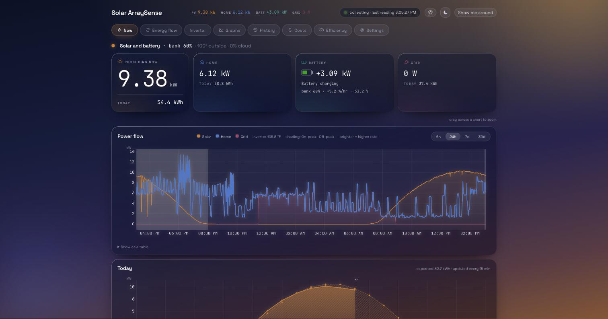
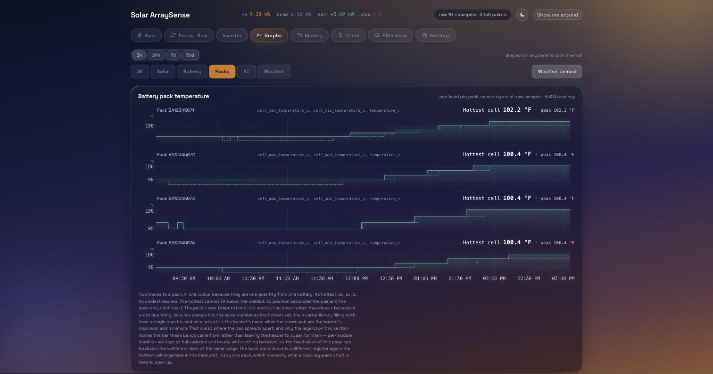
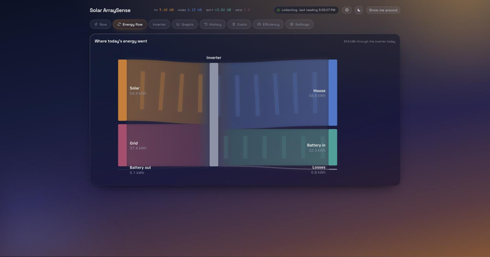
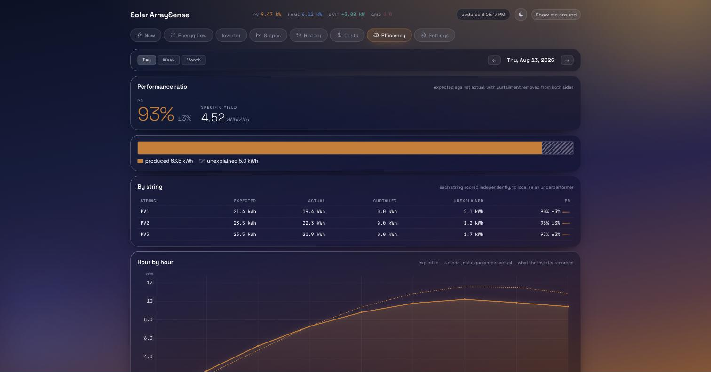
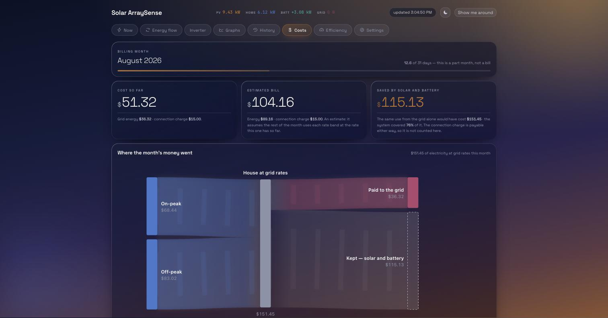
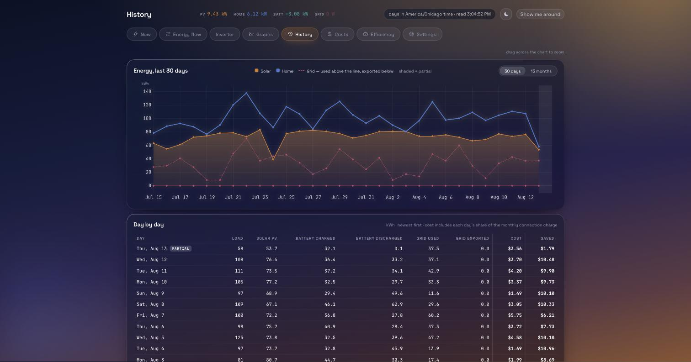

# Solar ArraySense

Open-source solar and battery monitoring for EG4 and LuxPower inverters — including
**per-module battery telemetry**, read over your local network. No cloud account, no
subscription, and your data never leaves the house.



> **Status: 1.0, running unattended on real hardware.** The reference installation —
> an EG4 18kPV with four EG4 indoor 280 Ah battery modules — has collected
> **308,678 full-cadence readings across 38 days**, on top of **674 days of
> hourly history**,
> polling over RS485 every eleven seconds. Every screenshot on this page is that
> installation, live, with hardware serials replaced by the documented placeholders.
>
> Authentication is optional and off until you set a password on the Settings
> page ([#34](https://github.com/sjordan0228/arraysense/issues/34)). When it is
> on it protects the write endpoints while the dashboard keeps reading without
> one, so a wall display never needs a login. It travels as plain HTTP on a home
> network, so it stops other devices changing things by accident or mischief,
> not anyone who can watch the traffic — keep it on your own network rather
> than exposing it to the internet.

## Supported hardware

One driver family today, the LuxPower register set that EG4 rebrands. Support is
listed by the *evidence behind it*, because a register that means one thing on a
hybrid can mean something else on an off-grid unit, and a wrong reading is worse
than a missing one.

| Model | Status |
| --- | --- |
| **EG4 18kPV** | **Measured.** The reference installation. Everything here was verified against it. |
| **EG4 12kPV** | Confirmed upstream — shares device type code 2092 with the 18kPV. |
| **EG4 FlexBOSS21** | Confirmed upstream — device type code 10284. |
| **EG4 FlexBOSS18** | Confirmed upstream — device type code 10284. |
| **EG4 6000XP** | Supported, off-grid family. Two PV strings, from the spec sheet. Five readings are withheld rather than guessed — see below. |
| **EG4 12000XP** | Supported, off-grid family. Two MPPT trackers behind four PV inputs, so two strings paralleled into one input share a measurement. The same five readings are withheld. |

EG4 is the US rebrand of LuxPower, so LuxPower units speaking the same protocol
should work.

### What the off-grid family changes

A 6000XP or 12000XP is not a smaller hybrid, and the driver says so rather than
reading the same registers and hoping. Five readings are declared **unreadable**
on those models, which is a different state from missing: the page shows nothing
there and says why, instead of a figure that looks measured.

| Withheld | Why |
| --- | --- |
| Generator power | Register 123 is a **seconds counter**, not generator power. A firmware disassembly found the comms handler answering it from a RAM word a timer increments about once a second, with no path from the power-conversion processor. |
| Generator voltage and frequency | Never examined by that firmware work. In a register block otherwise full of housekeeping words, assuming these two alone are genuine measurements is a weak bet, and a wrong reading cannot be un-stored. |
| Grid export today and lifetime | This family cannot sell back, so the counters have nothing to hold. |

Those last two are deliberately more conservative than upstream, which withheld
only the power and energy sensors. Adding a reading back once somebody confirms
it costs nothing; months of wrong readings cannot be taken back.

Everything else reads locally, including **your house load total**. Only the
*itemisation* of smart-load circuits has no local register, which is the part
still open in [#122](https://github.com/sjordan0228/arraysense/issues/122).

### How it connects — read this before buying a dongle

Two transports, and the dongle one is narrower than "WiFi dongle" suggests.

| Connection | Supported | Notes |
| --- | --- | --- |
| **Wired RS485 / Modbus** | ✅ **Recommended** | A USB-to-RS485 adapter on the inverter's 485A/485B terminals. What the reference installation runs. No firmware can take it away, and nothing competes for it. |
| **LuxPower/EG4 WiFi dongle, TCP port 8000** | ✅ The only dongle supported | The proprietary LuxPower protocol, authenticated with the dongle's serial. |
| **The same WiFi dongle on newer firmware** | ❌ | Some firmware has **no port 8000 at all**, and there is **no way to re-enable it**. A dongle that worked can stop after an update. |
| **Ethernet dongles** | ❌ | They never exposed port 8000. Not usable, at any firmware version. |
| Any other vendor's dongle | ❌ | Different protocol entirely. |

Two more things about the WiFi dongle specifically:

- It accepts **exactly one TCP client**. Anything else already polling it — the EG4
  app, Solar Assistant, a Home Assistant integration — will fight with this one and
  both will lose readings. Run only one.
- Firmware updates go through the vendor's app, which needs that same single slot,
  so the service has a yield mode to hand it back temporarily.

This is precisely why the transport is pluggable and why **RS485 is the path this
project treats as durable**. If you are choosing today, choose RS485.

Want to try it without an inverter? A simulated driver ships in the box — set
`driver = "fake"` and everything below runs against generated data.

### Your inverter not listed?

**[Open a hardware request →](https://github.com/sjordan0228/arraysense/issues/new?template=hardware-request.yml)**

Other families are absolutely intended — the transport and the driver registry were
built to make adding one a directory plus a line of registration, not a rewrite. What
gates it is evidence rather than effort: nothing ships as supported until its
registers have been confirmed against real hardware. If you have a unit and can help
test, say so in the request; that is the thing that actually unblocks a family.

## Why this exists

Existing options make you choose between a local tool with thin battery data and a
vendor cloud that has the detail but wants your data and a subscription. This reads
the detail locally.

The interesting part is that per-battery data is already sitting in the inverter, at
undocumented input registers 5002–5121. Per module you get state of charge, state of
health, cycle count, current and voltage, the highest and lowest cell voltage **with
the cell index for each**, and the same for cell temperature. That last part matters
most: cell delta — the earliest warning of a weak cell — becomes computable with no
extra hardware, down to which cell in which module.



## What it records

**175 columns per poll**: 91 inverter measurements and 21 for each of four battery
modules, plus six site readings from the weather service. Alongside the obvious power
and voltage figures that means per-string current, both heatsink temperatures,
split-phase backup output leg by leg, the charge and discharge limits the BMS is
currently imposing, and remaining capacity in amp-hours rather than only as a
percentage.

Energy comes from the inverter's own kWh counters, daily and lifetime, rather than
from integrating power. Integration agrees on a clean day and quietly undercounts
after any gap in collection; the counters keep counting through ours.

Two rules govern all of it. **A reading the inverter did not report is stored as NULL
and rendered as a gap, never as zero** — a battery block empty because the CAN link
dropped must not appear as a pack at 0%. And every metric carries plausible bounds,
so a decode error is caught on the way in rather than recorded as fact.

### Where the energy actually went



### What it should have produced, against what it did

Expected output is modelled from sun position, plane-of-array irradiance and cell
temperature — including wind, which is worth up to 12% of output on a hot still day —
then scored against what the inverter recorded, per string, so an underperformer can
be localised rather than merely suspected. Curtailment is separated out, because an
inverter protecting a full battery is not a fault.



### What it cost, and what solar saved

Rate bands with seasons, monthly adjustment factors, an estimated bill, and the
counterfactual: what the same use would have cost from the grid alone.



### Thirty days, and thirteen months



### Telling a drifting gauge apart from a failing battery

Each pack estimates its charge by counting amp-hours, and that count cannot correct
itself until the pack charges fully. Packs left to drift disagree with each other by
tens of points while sitting within a few tens of millivolts — which means they hold
the same charge and only the counters are wrong.

The dashboard says exactly that, rather than implying the batteries are diverging. It
finds full-charge events in stored history, tracks how long it has been since one, and
marks per-pack percentages as estimates once they are too stale to act on. The case
where packs genuinely disagree on *voltage* is reported separately and more loudly,
because parallel packs are forced to the same voltage and a spread there means a
cable, a lug or a busbar rather than arithmetic.

### What is actually drawing the power

Where an [Emporia Vue](https://www.emporiaenergy.com/) account is connected, the
Graphs page adds a Circuits tab: the top five circuits by energy over whatever range
is on screen, each drawn as its own strip scaled to its own peak, with that peak
printed beside it — a 40 W circuit and a 4,000 W one sharing an axis would erase the
smaller one. Change the range and the ranking follows it, so a kettle that led a
one-hour window can drop out of the top five over a week; an expander reveals the
rest. A gap in a strip means the circuit recorded nothing there, not that it drew
nothing — a dead outlet and an idle one look different. A circuit that has gone
quiet for good, rather than for a poll or two, draws no chart at all: just the
reason and how long, instead of an empty box that reads as a bug.

A summary panel above the strips reads the same window two ways: a ranked kWh bar
chart by default, whose length alone carries the meaning, and a stacked view of the
same circuits under the house's own load over time behind a switch. Underneath it a
line states what share of the house the monitored circuits account for — the
monitored circuits are not the whole house, and the page says what fraction they are
rather than letting five bars imply they are all of it. That share is computed from
energy rather than from minutes watched, and withheld rather than guessed whenever
an honest figure cannot be given.

Clicking a circuit's name on the Emporia page opens its own history on this tab, as
a real link that can be copied and sent.

## Install

One line, on a Linux host with systemd — a Raspberry Pi is the usual target:

```bash
curl -fsSL https://raw.githubusercontent.com/sjordan0228/arraysense/main/install.py | sudo python3 -
```

That is the whole install. The script is written to be read before it is trusted:
it is **standard library only** and parses on the Python 3.8 a distribution ships,
it **fetches exactly two things** — [uv](https://docs.astral.sh/uv/)'s installer and
this repository — and it **prints everything it intends to do before doing any of
it**. It asks its questions on the terminal rather than stdin, so piping into `sudo`
cannot swallow your answers, and it is safe to re-run over a partial install.

It checks the host first and refuses with a reason rather than failing halfway:
architecture, systemd, and at least 2 GB free. Then it installs uv, has it fetch
Python 3.12, clones to `/opt/arraysense`, creates the service account, and installs
the systemd service plus the daily backup timer.

For an unattended install:

```bash
sudo python3 install.py --yes --port 8090
```

`--repo URL` installs from a fork and `--ref NAME` pins a branch, tag or commit.

### Then set it up in the browser

The installer prints the address. Open it and you get a first-run wizard rather than
a dashboard — pick the manufacturer, the model and how it is wired, and it starts
collecting. Everything is changeable afterwards on the settings page.


Full instructions are in [docs/installation.md](docs/installation.md), including the
Raspberry Pi path in [docs/raspberry-pi.md](docs/raspberry-pi.md) — which covers the
RS485 wiring, the USB adapter, and the two systemd settings a serial install needs.

### How much disk

About **5.3 MB a day** at the default eleven-second cadence. Retention is available
and **off by default** — deleting readings cannot be undone, so it stays your
decision. Turn it on and full-cadence data is kept 30 days and minute data a year,
with hourly kept for ever; nothing is deleted without a current backup and without
the coarser tiers already holding every bucket being dropped. See
[docs/configuration.md](docs/configuration.md#data-retention).

## Documentation

- [docs/installation.md](docs/installation.md) — hardware requirements and setup
- [docs/raspberry-pi.md](docs/raspberry-pi.md) — running it on a Pi: the SD card, the
  USB SSD, and reaching the inverter over RS485
- [docs/configuration.md](docs/configuration.md) — configuration and retention reference
- [docs/api.md](docs/api.md) — HTTP API reference
- [docs/troubleshooting.md](docs/troubleshooting.md) — dongle connection problems,
  missing battery data, and other things people run into
- [docs/migrating-from-solar-assistant.md](docs/migrating-from-solar-assistant.md) —
  bringing your SolarAssistant history across, so switching does not cost you it
- [docs/backfilling-emporia-history.md](docs/backfilling-emporia-history.md) —
  filling the Circuits tab with the months your Vue recorded before you connected it

## Development

Requires [uv](https://docs.astral.sh/uv/). Python 3.12 is installed automatically.

```bash
uv sync                 # install everything
uv run pytest           # tests
uv run ruff check .     # lint
uv run ruff format .    # format
uv run mypy             # type check
```

All four checks must pass before a change is complete.

### Layout

| Path | Responsibility |
| --- | --- |
| `src/arraysense/metrics.py` | metric registry — names, units, integer scaling, plausible bounds |
| `src/arraysense/models.py` | wire-independent sample model |
| `src/arraysense/calibration.py` | state-of-charge drift detection from stored history |
| `src/arraysense/solar.py` | sun position, plane-of-array irradiance, expected output |
| `src/arraysense/drivers/` | inverter transports — one directory per family |
| `src/arraysense/collector/` | poll loop, backoff, gap recording, and weather |
| `src/arraysense/store/` | tiered SQLite storage, rollups and retention |
| `src/arraysense/api/` | HTTP API |
| `src/arraysense/web/` | the dashboard |

`metrics.py` is the single source of truth; schema, validation and the API all derive
from it, so adding a metric is a one-line change there. Adding an inverter family is a
directory under `drivers/` plus one line of registration — the collector does not
change.

## Licence

[AGPL-3.0-or-later](LICENSE). Chosen deliberately: anyone may run and modify this, but
a modified version offered as a service must publish its source, which prevents this
being turned into a closed product.

## Vendored

[uPlot](https://github.com/leeoniya/uPlot) (MIT) is committed under
`src/arraysense/web/` rather than loaded from a CDN. The service runs on home networks
that may have no route to the internet, and a chart library that silently fails to
load leaves a blank panel with no clue why. Its licence ships alongside it as
`uPlot.LICENSE`.
